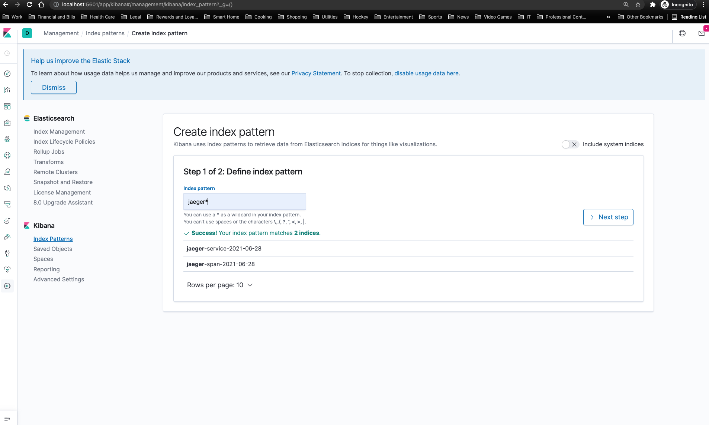
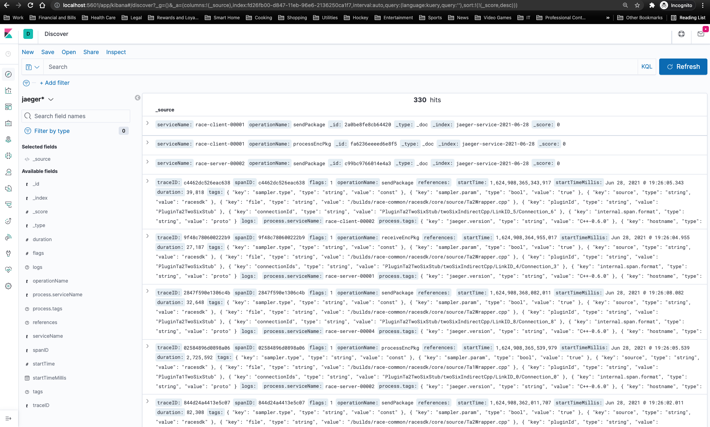

# Debugging with Kibana

Kibana is a frontend application for viewing information stored in Elasticsearch. The RACE SDK utilizes Elasticsearch as a backend for storing data generated by OpenTracing/JaegerTracing and APL utilizes Elasticsearch for distributed logging.

The Kibana UI is included with RiB deployments as of 1.4.0 to provide a way of debugging and looking at RACE logs that are generated by RACE without having to look through multiple logfiles. Future releases of RACE will log more data to ES.

## Table of Contents

* [How to Access Kibana](#how-to-access-kibana)
* [How to Set Up Index Patterns](#how-to-set-up-index-patterns)
* [How to View Data](#how-to-view-data)
* [More](#more)

## How to Access Kibana

Once a deployment has been `started` (following the documents [here](../HOWTO-TA1.md)), you can access the Kibana UI located at [here](http://localhost:5601/app/kibana#)

*NOTE* A deployment must be started and data generated before proceeding to the next step, as Kibana needs to pull data to create index patterns.

## How to Set Up Index Patterns

To track data with Kibana, you must set up and index pattern to retrieve data from ES. 

To create an index pattern, navigate [here](http://localhost:5601/app/kibana#/management/kibana/index_pattern?_g=()) and create a pattern `jaeger*` to begin tracking jaeger date

## How to View Data

To view and filter logs, navigate [here](http://localhost:5601/app/kibana#/discover) to the "Discover" page

## More

Kibana documentation [here](https://www.elastic.co/guide/en/kibana/7.6/index.html) can be useful for graphing, viewing, and filtering logs.
