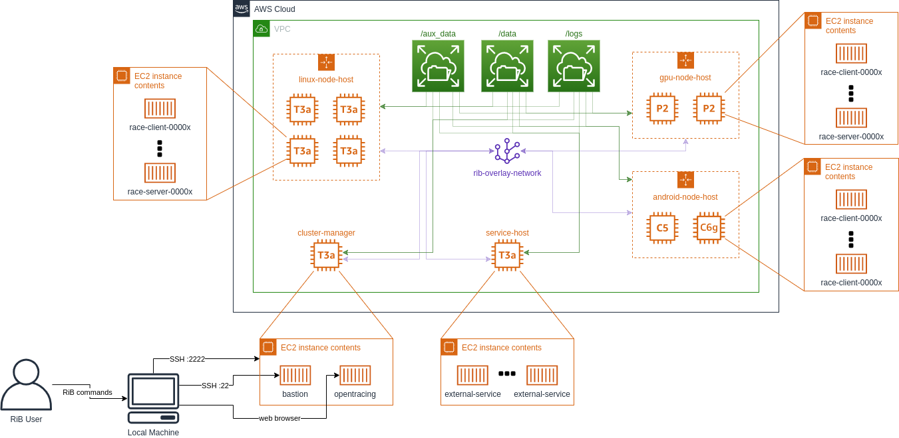

# RiB with AWS

RiB With AWS enables RiB to create, destroy, and leverage AWS resources for
scale testing RACE solutions at a scale not supported with local mode and in
between test events/rehearsals.

__WARNING:__ Please thoroughly review the first section
[Limitations and Warnings](#limitations-and-warnings) as there are costs and
other critical pieces of information to understand before using RiB with AWS.

## Table of Contents

* [Limitations and Warnings](#limitations-and-warnings)
    * [Resources and Cost](#resources-0and-cost)
    * [Android](#android)
    * [GPUs](#gpus)
    * [Quotas](#quotas)
* [Core Technologies](#core-technologies)
    * [AWS IAM User and Access Key](#aws-iam-user-and-access-key)
    * [Docker Swarm Compliant Docker-Compose Files](#docker-swarm-compliant-docker-compose-files)
* [Prerequisites](#prerequisites)
* [RiB AWS Environments](#rib-aws-environments)
    * [RACE Images](#race-images)
* [RiB AWS Deployment](#rib-aws-deployment)
* [How Tos](#how-tos)

## Limitations and Warnings

### Resources and Cost

__WARNING:__ This feature utilizes AWS's resources and are subject to AWS costs.
This document will describe how to utilze the RiB tool with AWS and highlight
some of the costs, but these are subject to change and vary depending on your
usage. It is highly encouraged to:

1. Understand what the tool is doing in AWS
2. Use the tool in a way to limit the costs associated with testing RACE
3. Monitor your team's AWS usage/costs
4. Verify/check your AWS to find stale/running envrionments that may not be
getting used or were abandoned accidentally (not unprovisioning an environment)

### Android

Android images are supported as of RiB v1.2.0, but there is some manual
requirements and callouts for android testing:

* Android images require `metal` EC2 instances (e.g. `*.metal`). These are
  necessary for hardware acceleration and are costly (approx $4.50 per hour per
  instance for `c5.metal`). It is highly recommended to test locally with Android
  first to confirm functionality and to use only one instance when doing base
  testing to reduce cost. The ARM (Graviton) EC2 instances are much cheaper
  ($2.176 for `c6g.metal` and $0.408 for `a1.metal`), so consider using these
  rather than the x86 instances.

### GPUs

As of RiB v1.4.0, GPUs are now supported in AWS environments, but there are some
callouts for GPU testing:

* GPU nodes require accelerated computing EC2 instances (e.g., `p2.xlarge`).
  These are very costly (ranging anywhere from $0.90 to $32.77 per hour per
  instance). It is highly recommended to test locally first to confirm
  functionality and to use only one instance when doing base testing to reduce
  cost.

### Quotas

AWS has hard quotas on some resources that may cause failures to use AWS mode.
Examples of these quotas include:

* 5 Elastic IPs
* 5 VPCs

If you are using a shared AWS account (for more than RiB), and get an error
about quotas, please reach out to Two Six Labs for help. The solution may be to
increase these quotas to allow for continued testing.

## Core Technologies

RiB is able to create/destroy and environment utilizing AWS resources to allow
for larger-scale testing with RiB. The core technologies utilized of this mode
includes:

* AWS Services:
    * [Cloudformation](https://aws.amazon.com/cloudformation/): creating and
      destroying AWS resources
    * [EC2](https://aws.amazon.com/ec2/): hosting RACE nodes and services
    * [EFS](https://aws.amazon.com/efs/): sharing data across EC2 instances
* [Docker Swarm](https://docs.docker.com/engine/swarm/): deploying bastion,
  OpenTracing, and RiB-specific orchestration services on AWS EC2 instances
* [Docker Compose](https://docs.docker.com/compose/): deploying RACE nodes
  containers on AWS EC2 instances
* [Ansible](https://www.ansible.com/): orchestration of remote technologies

## Prerequisites

Before using RiB with AWS, there are some prerequisites (documented
[here](aws-prerequisites.md)) that need to be completed to set up your AWS
account and RiB.

## RiB AWS Environments

RiB AWS Environments (managed with `rib env aws` commands) are responsible for
the configuration of resources in AWS, the deployment and teardown of these
resources, and monitoring AWS usage.

AWS Environments do not control RACE nodes or RACE apps; that is the
responsibility of RiB AWS Deployments. The output of an AWS Env is the
infrastructure to run/test a RiB Deployment.

## RiB AWS Deployments

RiB AWS Deployments (managed with `rib deployment aws COMMAND` commands) will be
used to configure/start/stop RACE nodes, start/stop the RACE application, push
configs, send messages, and more with a deployment on an AWS Environment.

This functionality assumes that there already is a running AWS Environment.

### RACE Images

RiB AWS Deployments pull docker images that are specified with
`--android-client-image`, `--linux-client-image`, and `--linux-server-image`.
(It uses the GitHub access token specified by `rib github config` if the images
are hosted in a private repository).

These images need to have all plugins installed in their expected locations for
testing. This is different than local mode (which mounts plugins dynamically).
Performers will be required to build their own images off of exemplar race
images (e.g. race-linux-client-exemplar) as defined in
https://wiki.race.twosixlabs.com/pages/viewpage.action?pageId=15598207.

After/Around test events, Two Six will also generate Complete images
(e.g. race-linux-client-complete) that have all performer plugins installed.
These are the images that will be tested on the range and will also be available
for testing with AWS environments.

## How Tos

How to documents will walk through actually utilizing AWS mode functionality

* [Setup an AWS Deployment](../how-to/deployment-setup/aws-deployments.md)
* [Audit/Manage RiB Related AWS Resources](../how-to/audit-and-manage-aws.md)
