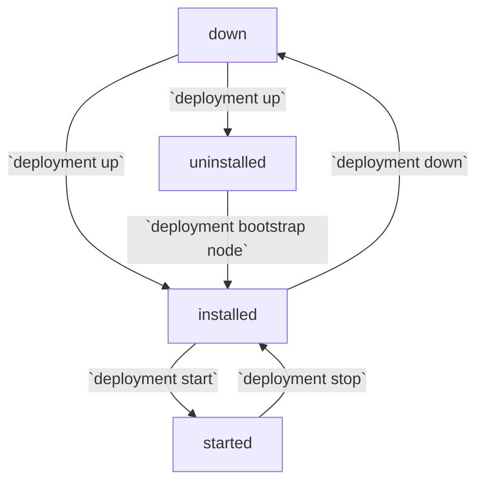
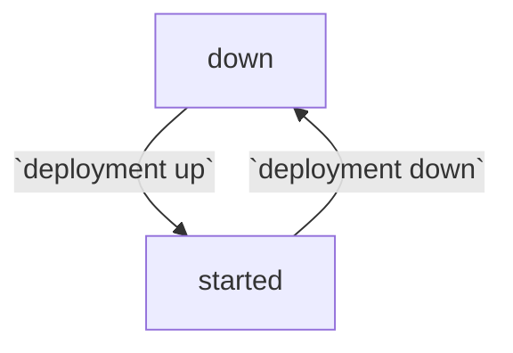
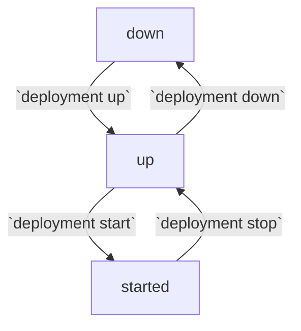
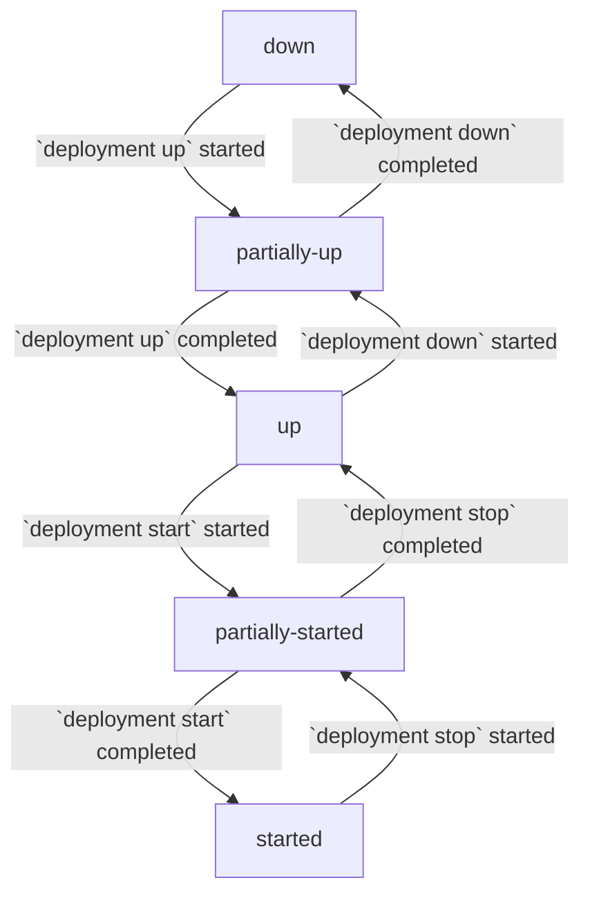

# Report Deployment App Status

Report the health status of all RACE apps in a deployment, including:
- RACE daemon status
- RACE client/server app status

## syntax

```
rib deployment <mode> status app <args>
```

## example

```
1) rib:x.y.z@code# rib deployment local status app --name=example-deployment
Deployment example-deployment apps are started
```

```
1) rib:x.y.z@code# rib deployment local status app --name=example-deployment -dd
Deployment example-deployment apps are partially started
    race-client-00001: started
        app: started
        daemon started
    race-client-00002: up
        app: installed
        daemon started
    race-server-00001: started
        app: started
        daemon started
    race-server-00002: started
        app: started
        daemon started
```

## required args

#### `--name TEXT`

Name of the deployment for which to report app status.

## optional args

#### `-d`

Increase the level of details included in the status report. By default, only
the top-level status of all apps is reported.

1. Detail level 1 adds the overall app status of each node
   ```
    race-client-00001: up
    race-client-00002: started
    ```
2. Detail level 2 adds the status of the daemon and RACE app for each node
   ```
    race-client-00001: up
        app: installed
        daemon: started
    race-client-00002: started
        app: started
        daemon: started
    ```

The default detail level can be set by running the
`rib config update --detail-level=<level>` command.

#### `--format [json|yaml]`

If specified, the raw output format in which the deployment app status is
printed to the console.

## status values

### app

#### `uninstalled`

The node does not have the RACE app installed. This is the expected status for
an uninstalled/bootstrap node after standing up a deployment.

#### `installed`

The node has the RACE app installed but the app is not running. This is the
expected status for a genesis (not bootstrapped) node after standing up a
deployment.

#### `started`

The RACE app is running on the node.



### daemon

#### `down`

The node container is not running or the daemon has stopped running. This is an
expected status if the deployment is down or the node container has been shut
down.

#### `started`

The daemon is running on the node.

#### `unknown`

The status of the daemon could not be determined. This may be due to the
deployment being in an unexpected state and RiB-specific orchestration services
are not running.

Use the `rib deployment <mode> status containers` command to investigate.



### node

#### `down`

The node container is not running or the daemon has stopped running. This is an
expected status if the deployment is down or the node container has been shut
down.

#### `up`

The node container and the daemon are running but the RACE app is not running.

#### `started`

The RACE app is running on the node.



### top-level

#### `down`

All nodes are down and not running.

#### `partially up`

Some nodes are up with a daemon running but no RACE apps are running. 

#### `up`

All nodes are up with a demon running and no RACE apps are running.

#### `partially started`

Some nodes are up with a RACE app running.

#### `started`

All nodes are up with all RACE apps running.


