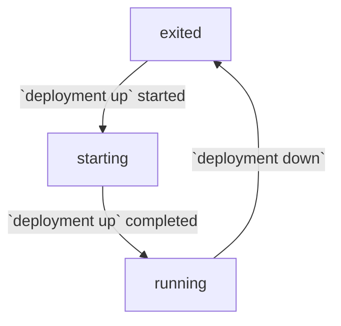
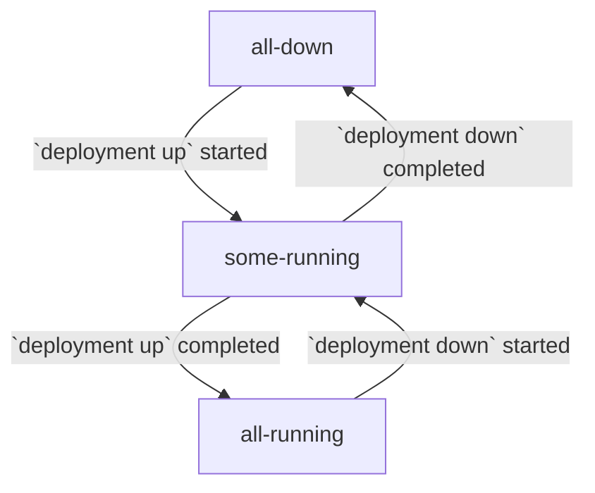

# Report Deployment Container Status

Report the health status of all containers in a deployment, including:
* RACE nodes
* OpenTracing and RiB-specific orchestration services

## syntax

```
rib deployment <mode> status containers <args>
```

## example

```
1) rib:x.y.z@code# rib deployment local status containers --name=example-deployment
Deployment example-deployment is all running
```

```
1) rib:x.y.z@code# rib deployment local status containers --name=example-deployment -dd
Deployment example-deployment is all running
    localhost: all running
        race-client-00001: running
        race-client-00002: running
        race-server-00001: running
        race-server-00002: running
```

## required args

#### `--name TEXT`

Name of the deployment for which to report container status.

## optional args

#### `-d`

Increase the level of details included in the status report. By default, only
the top-level status of all containers is reported.

1. Detail level 1 adds the overall container status of each host (only
   `localhost` in local deployments)
   ```
    localhost: all running
    ```
2. Detail level 2 adds the status of each container on each host (only
   `localhost` in local deployments)
   ```
    localhost: all running
        race-client-00001: running
        race-client-00002: running
        race-server-00001: running
        race-server-00002: running
    ```

The default detail level can be set by running the
`rib config update --detail-level=<level>` command.

#### `--format [json|yaml]`

If specified, the raw output format in which the deployment container status is
printed to the console.

## status values

### container

#### `exited` or `down`

The container is not running.

#### `starting`

The container has been started but is not finished initializing. This usually
means that the health check for the container does not yet pass.

#### `running` or `healthy`

The container is running and its healthy check (if defined) is passing.

#### `unhealthy`

The container is running but its health check is failing.

#### `unknown`

The status of the container could not be determined. This may be due to an
unrecognized state reported by docker.



### top-level

#### `all down` or `down`

All containers are not running.

#### `all running` or `healthy`

All containers are running and healthy.

#### `some running`

Some containers are not running, but not all.

#### `error` or `unhealthy`

Some containers are unhealthy.

#### `unknown`

Some containers have an unknown status.


