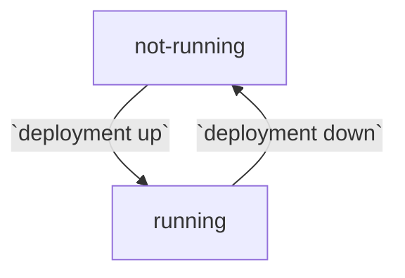
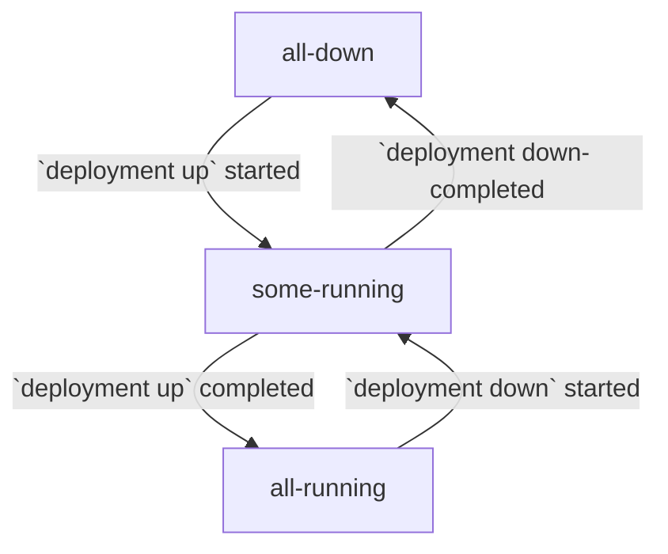

# Report Deployment Service Status

Report the health status of services in a deployment, including:
* Comms channel and artifact manager plugin external services
* OpenTracing and RiB-specific orchestration services

## syntax

```
rib deployment <mode> status services <args>
```

## example

```
1) rib:x.y.z@code# rib deployment local status services --name=example-deployment
Deployment example-deployment services status all running
```

```
1) rib:x.y.z@code# rib deployment local status services --name=example-deployment -dd
Deployment example-deployment services status all running
    External Services: all running
	    PluginArtifactManagerTwoSixCpp: running
	    twoSixIndirectCpp: running
	RiB: all running
		ElasticSearch: running
		File Server: running
		Jaeger UI: running
		kibana: running
		Redis: healthy
```

## required args

#### `--name TEXT`

Name of the deployment for which to report service status.

## optional args

#### `-d`

Increase the level of details included in the status report. By default, only
the top-level status of all services is reported.

1. Detail level 1 adds the overall service status of each service category
   ```
    External Services: all running
    RiB: all running
    ```
2. Detail level 2 adds the status of each service in each category
   ```
    External Services: all running
	    PluginArtifactManagerTwoSixCpp: running
	    twoSixIndirectCpp: running
	RiB: all running
		ElasticSearch: running
		File Server: running
		Jaeger UI: running
		kibana: running
		Redis: healthy
    ```

The default detail level can be set by running the
`rib config update --detail-level=<level>` command.

#### `--format [json|yaml]`

If specified, the raw output format in which the deployment service status is
printed to the console.

## status values

### service

#### `not running` or `unhealthy`

The service is not running or not passing health checks.

#### `running` or `healthy`

The service is running and passing health checks.



### top-level

#### `all down` or `down`

All services are not running.

#### `all running` or `healthy`

All services are running and healthy.

#### `some running` or `missing`

Some services are running, but not all.

#### `error` or `unhealthy`

Some services are unhealthy.


