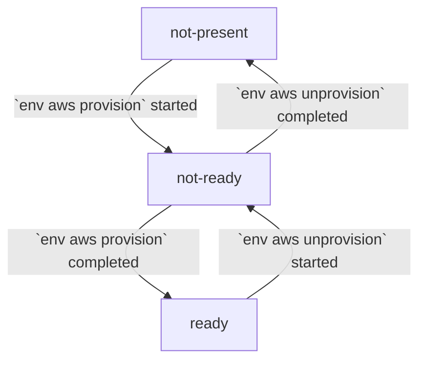

# Report AWS Environment Status

Report the health status of all resources in an AWS environment, including:
- CloudFormation stacks
- EFS volumes
- EC2 instances
  - SSH connectivity
  - EFS volume mounts
  - Docker installation

## syntax

```
rib env aws status <args>
```

## example

```
1) rib:x.y.z@code# rib env aws status --name=example-aws-env
Using default detail level: 0
AWS Environment example-aws-env is ready
```

```
1) rib:x.y.z@code# rib env aws status --name=example-aws-env -d
AWS Environment example-aws-env is ready
	cloud formation: ready
	ec2 instance: ready
	efs: ready
```

```
1) rib:x.y.z@code# rib env aws status --name=example-aws-env -ddddd
AWS Environment example-aws-env is ready
	cloud formation: ready
		race-example-aws-env-android-node-host: ready
		race-example-aws-env-cluster-manager: ready
		race-example-aws-env-efs: ready
		race-example-aws-env-gpu-node-host: ready
		race-example-aws-env-linux-node-host: ready
		race-example-aws-env-network: ready
		race-example-aws-env-service-host: ready
	ec2 instance: ready
		android-node-host: ready
			ec2-54-242-56-152.compute-1.amazonaws.com: ready
				EC2 state: ready
				host requirements: ready
					data mount: ready
					docker: ready
					ssh: ready
		cluster-manager: ready
			ec2-3-87-139-229.compute-1.amazonaws.com: ready
				EC2 state: ready
				host requirements: ready
					data mount: ready
					docker: ready
					ssh: ready
		gpu-node-host: ready
			ec2-3-82-64-231.compute-1.amazonaws.com: ready
				EC2 state: ready
				host requirements: ready
					data mount: ready
					docker: ready
					ssh: ready
			ec2-54-196-99-132.compute-1.amazonaws.com: ready
				EC2 state: ready
				host requirements: ready
					data mount: ready
					docker: ready
					ssh: ready
		linux-node-host: ready
			ec2-3-81-34-247.compute-1.amazonaws.com: ready
				EC2 state: ready
				host requirements: ready
					data mount: ready
					docker: ready
					ssh: ready
			ec2-3-91-37-77.compute-1.amazonaws.com: ready
				EC2 state: ready
				host requirements: ready
					data mount: ready
					docker: ready
					ssh: ready
			ec2-54-91-254-209.compute-1.amazonaws.com: ready
				EC2 state: ready
				host requirements: ready
					data mount: ready
					docker: ready
					ssh: ready
		service-host: ready
			ec2-54-144-32-96.compute-1.amazonaws.com: ready
				EC2 state: ready
				host requirements: ready
					data mount: ready
					docker: ready
					ssh: ready
	efs: ready
		race-example-aws-env-DataFileSystem: ready
```

## required args

#### `--name TEXT`

Name of the AWS environment for which to report status. If no AWS environment
exists with the given name, the command will fail.

## optional args

#### `-d`

Increase the level of details included in the status report. By default, only
the top-level status of the AWS environment is reported.

1. Detail level 1 adds the overall status of each type of AWS resource (e.g.,
   CloudFormation, EFS, EC2)
   ```
	cloud formation: ready
	ec2 instance: ready
	efs: ready
	```
2. Detail level 2 adds the status of each instance of an AWS resource (e.g.,
   CloudFormation stack, EFS volumes, EC2 groups)
   ```
	cloud formation: ready
		race-example-aws-env-android-node-host: ready
	ec2 instance: ready
		android-node-host: ready
	efs: ready
		race-example-aws-env-DataFileSystem: ready
	```
3. Detail level 3 adds the status of individual EC2 instances
   ```
	cloud formation: ready
		race-example-aws-env-android-node-host: ready
	ec2 instance: ready
		android-node-host: ready
			ec2-54-242-56-152.compute-1.amazonaws.com: ready
	efs: ready
		race-example-aws-env-DataFileSystem: ready
	```
4. Detail level 4 adds further information about each EC2 instance
   ```
	cloud formation: ready
		race-example-aws-env-android-node-host: ready
	ec2 instance: ready
		android-node-host: ready
			ec2-54-242-56-152.compute-1.amazonaws.com: ready
				EC2 state: ready
				host requirements: ready
	efs: ready
		race-example-aws-env-DataFileSystem: ready
	```
5. Detail level 5 is the most detailed, and adds the results from all status
   checks for each EC2 instance
   ```
	cloud formation: ready
		race-example-aws-env-android-node-host: ready
	ec2 instance: ready
		android-node-host: ready
			ec2-54-242-56-152.compute-1.amazonaws.com: ready
				EC2 state: ready
				host requirements: ready
					data mount: ready
					docker: ready
					ssh: ready
	efs: ready
		race-example-aws-env-DataFileSystem: ready
	```

The default detail level can be set by running the
`rib config update --detail-level=<level>` command.

#### `--format [json|yaml]`

If specified, the raw output format in which the AWS environment status is
printed to the console.

## status values

#### `not present`

The AWS resource has not yet been created.

#### `not ready`

The AWS resource exists but is not in a usable state. The resource may be in
the middle of being provisioned or unprovisioned.

#### `ready`

The AWS resource exists and is in a fully usable state.

#### `error`

An error has occurrerd during the creation or provisioning of the AWS resource.

#### `unknown`

The status of the AWS resource could not be determined. This may be due to an
unrecognized AWS state.

### status flow diagram



## notes

* AWS resources will cost money per minute; If a status is anything but
  `not present`, you will be paying money for some resouces for the environment.
* Even with a `not present` status, it is still recommended to check to see if
  any RiB stacks are running in any capacity to make sure nothing is left
  running and costing money unless expected
